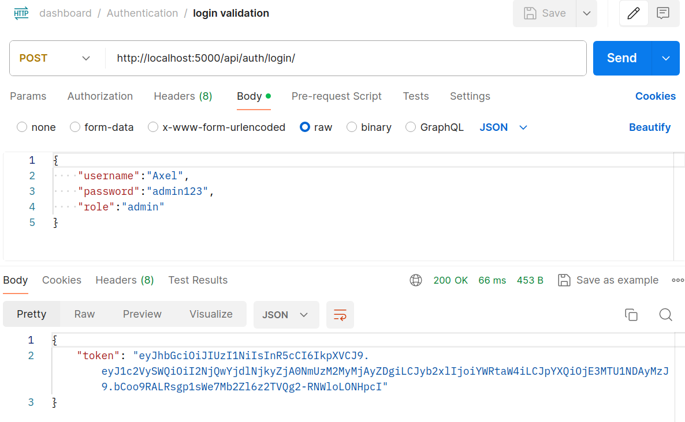
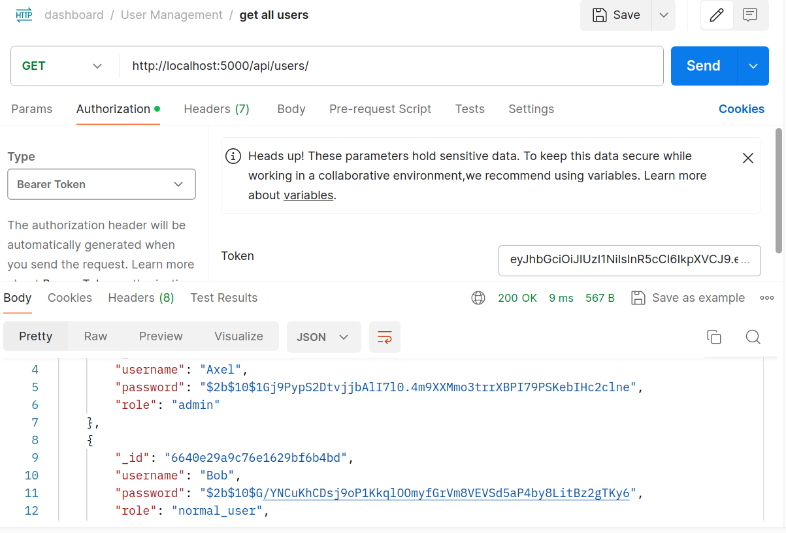
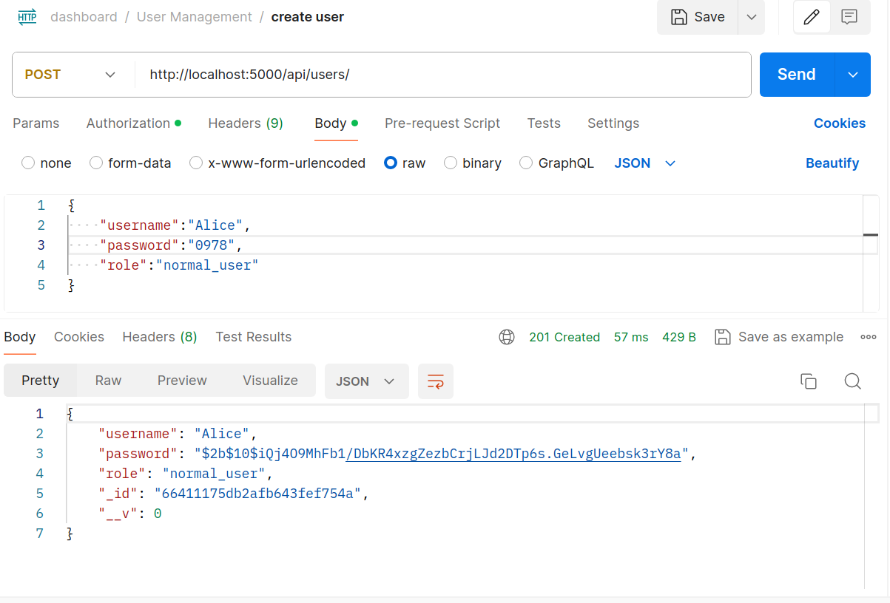
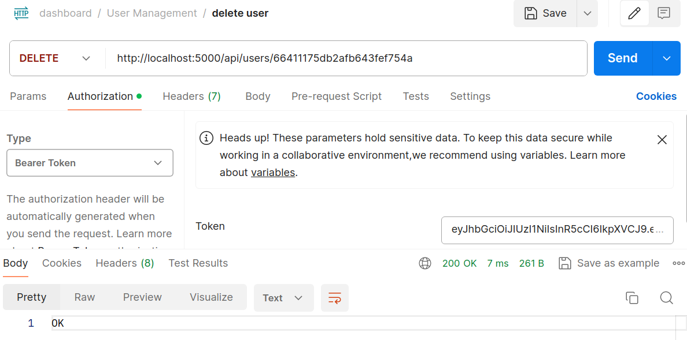
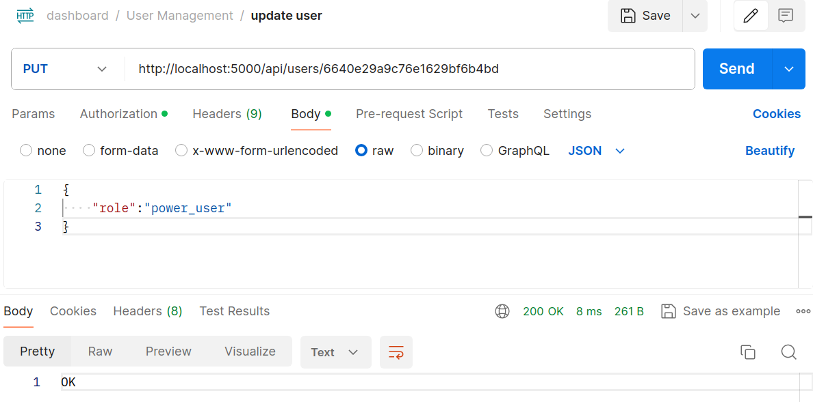

## Task 5 ##
Developed the required backend in NodeJS+MongoDB and tested on Postman API. \
The high level archietecture of the server.

### Current Progress 
- Login Service
- JWT Authentication + Role Based Access
- APIs for User Management
- APIs for Signal Management

### Login Service, Auth and Validation
 Used JWT token for authentication of the request. Login include username, password and role. \
 Postman testing for same:\
 

### APIs for User Management
All the api endpoint can be accessed by only those users who have admin role.
- `getAllUser()`: Get all the user info.

- `createUser()`: Create a new user.

- `deleteUser()` : Delete an existing user.

- `updateUser()` : To change the role of the user.
